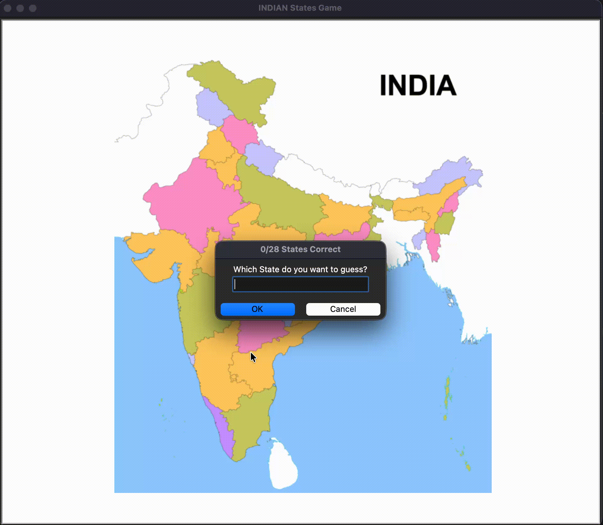

# Indian States Game 🗺️

A fun and educational Python game where players can test their knowledge of Indian states by guessing their names on a map.  

This project uses Python's `turtle` graphics library to display a map of India and allows users to input state names to locate them visually.

---

## Demo

  

*The game highlights the guessed states on the map in real-time.*  

---

## Features

- Interactive map of India using `turtle`.
- Prompts the user to guess state names.
- Displays correctly guessed states on the map.
- Keeps track of the number of correct guesses.
- Option to exit the game at any time.

---

## How to Play

1. Run the `main.py` script.
2. A window with the map of India (`india.gif`) will open.
3. Enter the name of a state when prompted.
4. If the state name is correct, it will appear on the map at its location.
5. Type `Exit` at any time to quit the game.
6. The game ends automatically when all 28 states are correctly guessed.

---

## Installation

1. Clone the repository:
   ```bash
   git clone https://github.com/dheerajdhami2001-cyber/name_the_states.git

2. Install the required Python library:

bash
Copy code
pip install pandas
3. Make sure your working directory contains:

* main.py (your game script)

* state_name.py (class for state coordinates)

* 28_states.csv (state names and coordinates)

* india.gif (map image)

Project Structure
bash
Copy code
name_the_states/
│
├── 28_states.csv       # State coordinates data
├── check_coordinate.py # Extra file for debugging/coordinate checking
├── demo.gif            # Demo animation
├── india.gif           # Map of India
├── main.py             # Main game logic
├── state_name.py       # StateName class for handling coordinates
└── README.md           # Project description


StateName Class Overview
state_name.py contains the StateName class:

all_names(): Returns a list of all states from the CSV file.

set_coordinate(state): Returns the (x, y) coordinates of a state.

move_to(coordinate, state): Moves the turtle to the state location and writes the state name.

Credits
This project idea and inspiration came from Angela Yu’s 100 Days of Code: The Complete Python Pro Bootcamp.
Huge thanks to Angela Yu for creating an engaging, professional, and beginner-friendly Python course that inspired this project!

License
This project is for educational purposes. Feel free to use and modify it for personal learning.
